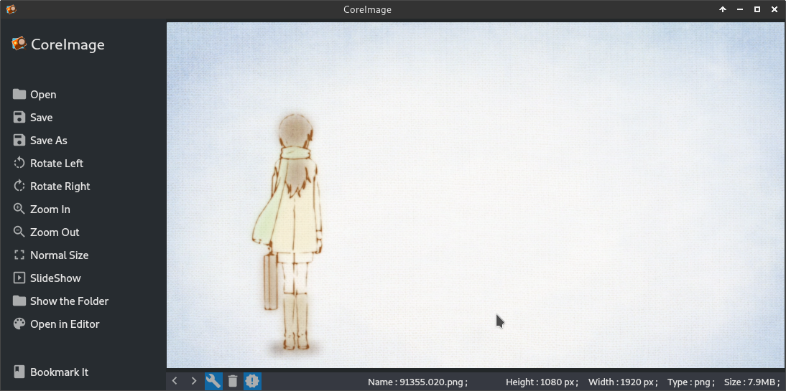

# CoreImage
An app of CoreApps family.CoreImage is image viewer.

### Download

### Changes in latest release

### Build

### Dependencies:
* qt5
* libcprime

## Tested In
* Manjaro xfce (Arch).
* Ubuntu 18.04 LTS.
* Qt toolkit vrsion 5.9 lts and 5.11.1 .

### Known Bugs

### Help Us
* We need to add package for this app.DEB is in top priority.so if any one could guide us how to do that it will be helpful.
* Also add the app in AUR.
* Some of the apps has old code,so they have some issue in them.Please review the code and help us fix them.
* See the "HelpUs" page in Help app for more problems.

### Feedback
* We need your feedback to improve the CoreBox.Send us your feedback through email or github [issues](https://github.com/rahmanshaber/corebox/issues "Title") .
* rahmanshaber@gmail.com
* s96mini.cube@yahoo.com